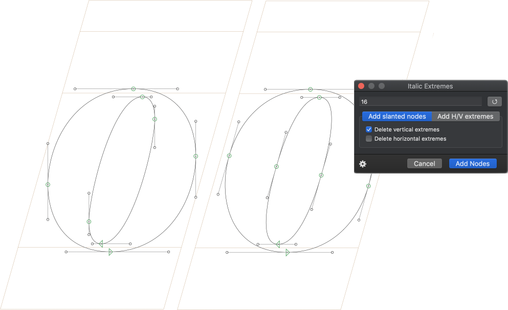

# ItalicExtremes

Glyphs app plugin to add points on a specified angle.

### How to use

The plugin can be used on all selected glyphs of an Edit tab, the entire active glyph in Edit mode, or only on a selection of segments if such a selection has been made.

The default angle is the italic angle from the selected master when opening the document.
Multiple angles can be entered separated by commas, and will be processed successively.

The checkboxes allow to optionally delete V/H extremes or slanted curve nodes that match the specified angles, effectively switching an outline between V/H and Italic extremes.

If you want to transform an outline with angled nodes on two different angles **and** remove both H/V extremes, its better to procede in two steps, ex: add nodes at 12deg + remove V extremes, then add nodes at -78deg + remove H extremes. Trying to do both at the same time will mess up the outlines as both H/V extremes will be removed while the first angle is processed.

It is recommended that you keep a copy of the original outline somewhere before using the plugin, either in background or a backup layer.

### License

Copyright 2020 Joachim Vu.

Based on the Glyphs plugin SDK sample code by Georg Seifert (@schriftgestalt).

Licensed under the Apache License, Version 2.0 (the "License");
you may not use this file except in compliance with the License.
You may obtain a copy of the License at

http://www.apache.org/licenses/LICENSE-2.0

See the License file included in this repository for further details.